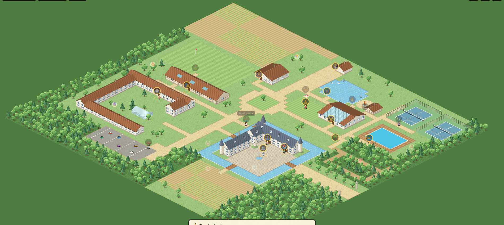
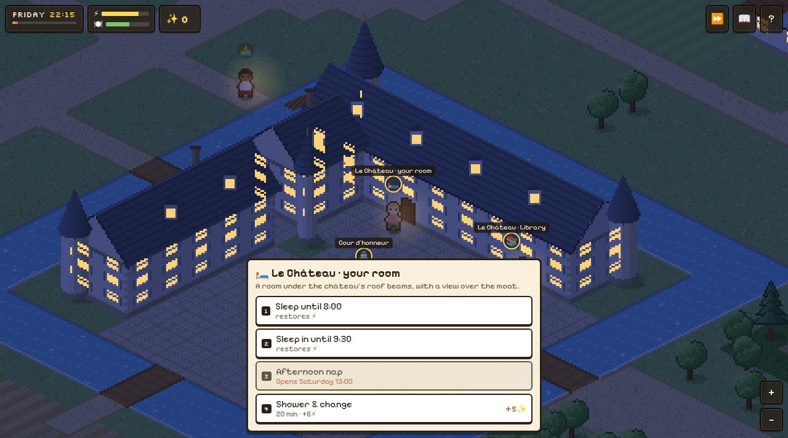

# Château de Campagne 🏰

An isometric, pixel-art weekend at a French country château. You get one weekend,
from Friday 18:00 to Sunday 17:00 check-out. Eat well, sleep well and do as much as you can.

The map is loosely based on the estate at **Villiers-le-Mahieu** (Yvelines):
a 1642 château on its moated island, the farm buildings of La Ferme, La Grange,
the Cottage, a pond, tennis courts, an outdoor pool and a tree-lined avenue.

**▶ Play it: https://jeanclawd.github.io/chateau-de-campagne/** (installable as an app, works offline)





## Play

Open the link above. On a phone, use **Add to Home Screen** to install it as a
full-screen app (PWA) that also works offline. To run it locally: it's a static
site with no build step and no dependencies:

```bash
python3 -m http.server 8000
# open http://localhost:8000
```

- **Tap / click** to walk. Tap a building or an icon to go there. Arrows or WASD also work.
- A **glowing ring** means something is on right now. Stand on the spot to see what's available.
- **✨ Points** come from activities. You get +15 the first time you do something. Doing the same thing again on the same day earns less.
- **🍽️ Meals score more when you're hungry.** If you skip meals you get hangry and everything scores half.
- **⚡ Energy**: sport uses it up. The spa, naps and coffee give it back. Sleep in your château room at night. If you run out, you collapse on a bench.
- The **Remise des Sports** lends rackets and golf clubs for free. La Table packs picnic baskets.
- **🧸 Gustave lost 8 toys** around the park.
- **🏅 Badges** reward combos (full spa circuit, three meals on Saturday, all-rounder…). The 📖 notebook lists them all, along with what's on and when.
- **⏩** fast-forwards time (F key). `+`/`−` zoom.
- **🇬🇧 / 🇫🇷** The game is in English and French. It starts in French, and you can switch in **⚙️ Settings** or on the title screen.

At check-out you get a rank, from *Stressed Parisian* up to *Châtelain·e*.

## How it's made

- **No image files.** Every sprite is drawn pixel by pixel into `ImageData` by a
  small software rasterizer (`js/pix.js`): iso tiles, walls with shuttered windows,
  gabled and slate roofs with dormers, round towers with conical roofs, trees,
  ducks and characters. Nothing is anti-aliased, so the pixels stay crisp.
- The world is drawn to a low-res buffer and scaled up by an integer factor.
- Depth sorting uses footprint boxes plus a topological sort. That's what lets
  you walk behind a long wing of the château and be drawn correctly.
- It's a PWA: a web manifest, pixel-art icons, and a service worker (`sw.js`) that
  precaches the game so it plays offline. It fetches from the network first and only
  uses the cache as an offline fallback.
- A day/night cycle multiplies a tint over the scene. At night the windows light up
  from a glow mask that is generated along with each building.
- `js/i18n.js` holds the UI strings and French overlays for all the content. They're applied
  in place when you switch language, so adding a language only means adding a dictionary.
- `js/data.js` holds every place, opening hour, activity, badge and rank. Tweak the
  balance there.

Test hooks: `?lang=fr&autostart&t=<minutes since Friday 00:00>&x=<tile>&y=<tile>&zoom=<n>`,
plus `&overview` to allow zooming all the way out.
`test/sim.html` runs a scripted playthrough.

Activities are inspired by what the real estate offers. This is a fan-made game
with no affiliation to the estate or its operator.

## License

MIT
